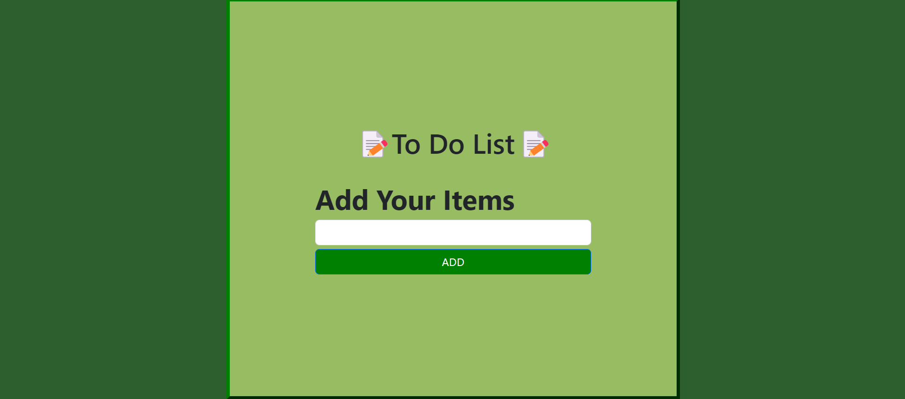
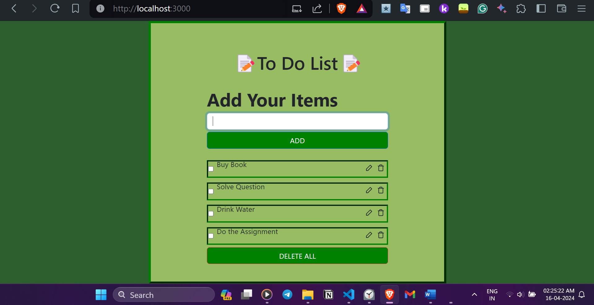
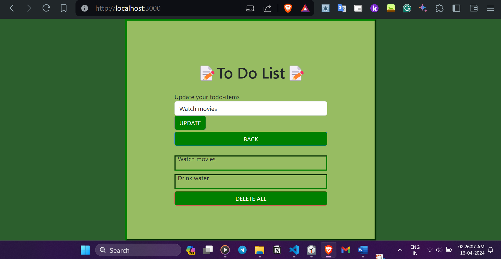
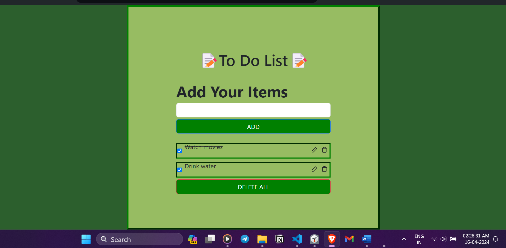

***
# TodoApp Redux

Welcome to TodoApp Redux! This is a simple todo list application built using React and Redux.

***

## Features

- **Add new todo items**: Easily add new tasks to your todo list.
- **Edit existing todo items**: Modify the tasks you've added.
- **Delete todo items**: Remove tasks from your todo list when they're no longer needed.
- **Mark todo items as completed**: Keep track of your completed tasks.
- **View todo items list**: See all your tasks with checkboxes and action buttons for easy management.

***






## Getting Started

To get started with TodoApp Redux, follow these steps:

1. **Clone the repository**:

   ```bash
   git clone <https://github.com/Asmit-Rai/QuadB-Assignment.git>

   
### Navigate to the project directory:

```bash
cd todoapp-redux-main
```

### install dependencies:

```bash
npm install
```

### Start the development server::

```bash
npm start
```

### Open your browser and navigate to http://localhost:3000 to view the app.


## Features
- Add new todo items
- Edit existing todo items
- Delete todo items
- Mark todo items as completed
- View todo items list

## Dependencies
- React: A JavaScript library for building user interfaces.
- Redux: A predictable state container for JavaScript apps.
- react-redux: Official React bindings for Redux.
- react-icons-kit: A collection of icon sets for React.

## Folder Structure
- src/components/Form.js: Contains the form component for adding and editing todo items.
- src/components/Todos.js: Contains the component for displaying the list of todo items.
- src/redux/todoapp/actions.js: Defines the action creators for adding, deleting, and updating todo items.
- src/redux/todoapp/reducer.js: Defines the reducer function for managing todo items state.

